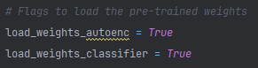
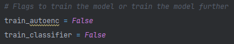
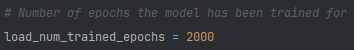

<h1 style="text-align: center">Integrating Auto-encoders for Effective Dimensionality Reduction in Image Classification</h1>

This project explores the use of auto-encoders for dimensionality reduction in the context of image classification. The Cat & Dog dataset is utilized for the classification task, and the implementation is carried out using the PyTorch library, encompassing both the auto-encoder and the classification model.

<h2>Project Highlights</h2>
<ul style="text-align: justify">
    <li><b>Dimensionality Reduction:</b> The project demonstrates the application of auto-encoders to reduce the dimensionality of input images, improving classification efficiency.</li>
    <li><b>Cat & Dog Dataset:</b> A popular benchmark dataset is used to validate the effectiveness of the approach.</li>
    <li><b>PyTorch Implementation:</b> Both the auto-encoder and the classification models are implemented using the PyTorch framework.</li>
</ul>

<h2>Pre-trained Models</h2>

Two models have already been trained and their weights are saved in the states 
directory. By default, the notebook is configured to load these pre-trained weights.

    

<h2>Customization Options</h2>

<ul style="text-align: justify">
    <li><b>Training from Scratch:</b> Although the notebook is set to load pre-trained 
    weights, you can opt to train the models from scratch by modifying the appropriate 
    training flags.</li>
</ul>

    

<ul style="text-align: justify">
    <li><b>Further Training:</b> If you wish to continue training the model for 
    additional epochs, you can load the pre-trained weights and adjust the
    training flags. The load_num_trained_epochs flag allows you to specify the 
    number of epochs already trained, enabling you to resume training seamlessly.</li>
</ul>

    

<h2>How to Run</h2>

<ol style="text-align: justify">
    <li><b>Step 1 :</b> Clone the repository.</li>
    <li><b>Step 2 :</b> Create a Python or Conda environment.</li>
    <li><b>Step 3 :</b> Install all required libraries.</li>
    <ol>
        <li>Using pip: <code>pip install torch torchvision numpy matplotlib tqdm pandas scikit-learn seaborn
            </code>
        </li>
        <li>Using conda: <code>conda install pytorch torchvision numpy matplotlib tqdm pandas scikit-learn seaborn
            </code>
        </li>
    </ol>
    <li><b>Step 4 :</b> Customize and run the notebook by adjusting the flags according to your requirements.</li>
</ol>